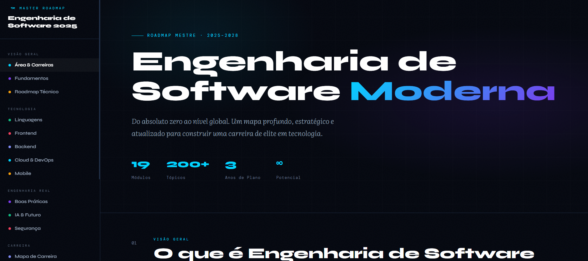

# ✨ Software Engineering Master Roadmap

Guia visual e estratégico de Engenharia de Software moderna, criado para organizar a jornada de aprendizado do absoluto zero até níveis avançados de engenharia, arquitetura e sistemas distribuídos.

---

## 🌐 Live Demo

👉 [Acessar projeto](COLE_AQUI_SEU_LINK_DO_NETLIFY)

---

## 📷 Preview

---

## 🎯 Objetivo

Centralizar conhecimentos essenciais da Engenharia de Software em uma experiência visual, moderna e intuitiva, facilitando estudos, planejamento de carreira e entendimento do ecossistema tecnológico atual.

---

## 🚀 O que o projeto aborda

- Fundamentos da Engenharia de Software
- Roadmap técnico completo
- Frontend, Backend e Mobile
- Cloud & DevOps
- Segurança e boas práticas
- IA, LLMs e futuro da tecnologia
- Big Techs e arquitetura em escala
- Portfólio profissional
- GitHub estratégico
- Plano de estudos estruturado
- Recursos, livros e plataformas recomendadas
- Mentalidade de engenharia de elite

---

## 🛠 Tecnologias utilizadas

- HTML5
- CSS3
- JavaScript
- Design responsivo
- UI moderna inspirada em dashboards premium

---

## ✨ Características

- Interface moderna e imersiva
- Navegação lateral organizada
- Estrutura visual estratégica
- Experiência responsiva
- Cards interativos
- Organização por seções
- Conteúdo altamente aprofundado

---

## 📚 Inspirações e referências

- Big Tech Engineering Cultures
- System Design
- Cloud Native Architecture
- Roadmap.sh
- DevOps Practices
- Engenharia de Software moderna

---

## 📌 Status

Projeto em evolução contínua.

---

## 👩‍💻 Autor

Desenvolvido como projeto de estudo, organização e aprofundamento em Engenharia de Software moderna.